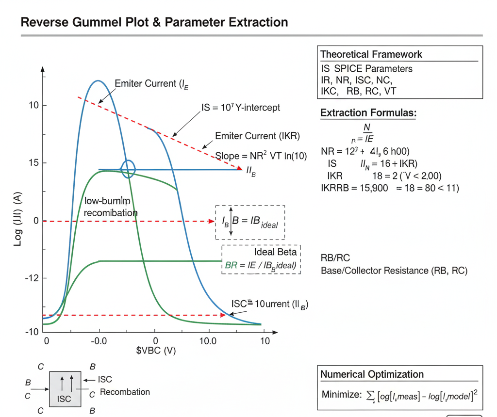

## Theory
**Introduction:**  
BJT Parameter Extraction from Reverse Gummel Plots

      
      
<strong>Fig. 1. Reverse Gummel Plot & Parameter Extraction</strong>

## Introduction

The **reverse Gummel plot** is the counterpart to the forward Gummel plot. It is essential for extracting the parameters that govern the BJT's operation in the **reverse-active** and **saturation** regions.

A reverse Gummel plot is generated by plotting the emitter current ($I_E$) and base current ($I_B$) on a logarithmic scale against the base-collector voltage ($V_{BC}$) on a linear scale. During this measurement, the base-emitter voltage is held constant at zero ($V_{BE} = 0$).

This measurement configuration effectively operates the transistor "backwards," with the collector acting as the emitter and the emitter acting as the collector.

## The Gummel-Poon Model (Reverse Active)

With $V_{BE} = 0$, the forward-active terms in the Gummel-Poon model become negligible. The model simplifies to describe the reverse-active operation:

$$
I_E \approx \frac{IS}{q_b} \cdot \left( e^{\frac{V_{BC}}{NR \cdot V_T}} - 1 \right)
$$

$$
I_B \approx \left[ \frac{IS}{BR} \cdot \left( e^{\frac{V_{BC}}{NR \cdot V_T}} - 1 \right) \right] + \left[ ISC \cdot \left( e^{\frac{V_{BC}}{NC \cdot V_T}} - 1 \right) \right]
$$

Where the key reverse-mode parameters are:
* **$IS$**: Transport Saturation Current (the same as in the forward model, per reciprocity).
* **$BR$**: Ideal Maximum Reverse Beta.
* **$NR$**: Reverse Current Emission Coefficient (ideality factor for $I_E$).
* **$ISC$**: Base-Collector Leakage Saturation Current.
* **$NC$**: Base-Collector Leakage Emission Coefficient (ideality factor for non-ideal $I_B$).
* **$q_b$**: Normalized base charge, which includes high-injection effects modeled by `IKR`.
* **$V_T$**: Thermal Voltage ($kT/q$).

## Graphical Extraction from Plot Regions

Similar to the forward plot, we analyze the different regions of the reverse Gummel plot.

### 1. Ideal Mid-Current Region

In this region, $I_E$ and the ideal component of $I_B$ are dominated by diffusion. They appear as parallel straight lines.

* **`IS` (Transport Saturation Current):**
    Extrapolate the linear (ideal) portion of the **$log(I_E)$** curve back to its intercept at $V_{BC} = 0$. Due to the Ebers-Moll reciprocity principle, this value **must be the same `IS`** extracted from the forward Gummel plot's $I_C$ curve. This provides a critical consistency check.
    **$IS = 10^{\text{intercept}}$**

* **`NR` (Reverse Emission Coefficient):**
    Find the slope of the linear (ideal) portion of the **$log(I_E)$** curve.
    **$\text{Slope}_{IE} = \frac{\Delta \log_{10}(I_E)}{\Delta V_{BC}} = \frac{1}{NR \cdot V_T \cdot \ln(10)}$**
    `NR` is typically very close to 1.0.

* **`BR` (Ideal Maximum Reverse Beta):**
    This is the ideal current gain in the reverse-active mode. It is found from the vertical separation between the ideal $I_E$ line and the (extrapolated) ideal $I_B$ line.
    **$BR = \frac{I_E}{I_{B, \text{ideal}}}$**
    For standard asymmetric BJTs (where the emitter is much more heavily doped than the collector), `BR` is very small (e.g., 0.1 to 5). This means the $log(I_E)$ and $log(I_B)$ curves will be very close together in this region.

### 2. Low-Current Region

At low $V_{BC}$, the non-ideal recombination current in the base-collector space-charge region dominates the base current $I_B$.

* **`NC` (B-C Leakage Emission Coefficient):**
    The $log(I_B)$ curve deviates from the ideal $N=1$ slope and follows a new, shallower slope. Find the slope of this line.
    **$\text{Slope}_{IB} = \frac{\Delta \log_{10}(I_B)}{\Delta V_{BC}} = \frac{1}{NC \cdot V_T \cdot \ln(10)}$**
    `NC` is typically between 1.5 and 2.0.

* **`ISC` (B-C Leakage Saturation Current):**
    Extrapolate this non-ideal (low-current) $log(I_B)$ line back to its intercept at $V_{BC} = 0$.
    **$ISC = 10^{\text{intercept}}$**
    Since the B-C junction area is typically much larger than the B-E junction area, `ISC` is usually much larger than `ISE`.

### 3. High-Current Region (Roll-off)

At high $V_{BC}$ and high currents, the curves "roll off" due to high-level injection and parasitic resistances.

* **`IKR` (Reverse High-Injection Knee):**
    This is the "knee" in the **$log(I_E)$** curve where its slope decreases. It models high-level injection in the collector region (which is acting as the emitter). `IKR` is the approximate emitter current at this knee. `IKR` is typically much smaller than its forward counterpart `IKF`.

* **Parasitic Resistances (`RB`, `RC`):**
    These resistances cause voltage drops that reduce the *internal* junction voltages.
    * **`RB` (Base Resistance):** The $I_B \cdot RB$ drop causes the $log(I_B)$ curve to roll off.
    * **`RC` (Collector Resistance):** The $I_E \cdot RC$ drop (since $I_E \approx I_C$ in this mode) is often the dominant resistive effect, causing **both $I_E$ and $I_B$ curves** to roll off.

## Summary

The reverse Gummel plot is **critical for modeling saturation**. The parameters extracted (`BR`, `ISC`, `NC`, `IKR`) are essential for any simulation where the BJT's base-collector junction becomes forward-biased, which is common in digital logic (ECL, TTL) and analog switching applications.

     
 
